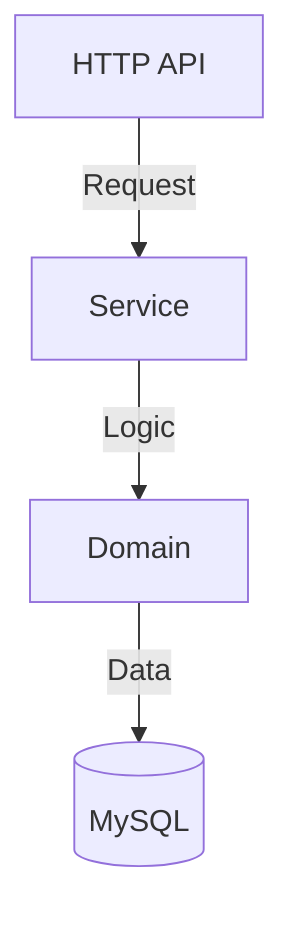

# codebase-insight-analyzer
## Goal
对已 clone 到本地的代码仓库进行结构化洞察，形成“全局上下文包”，帮助后续缺陷校验理解：系统分层、业务域边界、关键模块及接口、功能模块的依赖关系与高风险区域。
---
## 📋 基本信息
| 属性 | 值 |
|------|-----|
| **Skill 名称** | codebase-insight-analyzer |
| **分类** | Tier 1: 全局理解 + Tier 2: 结构理解 |
| **目标应用场景** | AI Coding Agent 快速理解新仓库 |
| **输出格式** | JSON (agent-consumable) + Markdown (human-readable) |
| **首次执行耗时** | 3-10 分钟（取决于仓库大小） |
| **后续增量更新** | < 30 秒（Git hook 触发） |
---
## 🎯 核心目标
生成**代码仓库的结构化"全局上下文包"**，使 AI Agent 能够：
1. **秒速定位** - 知道从哪里开始读代码（入口点、关键文件）
2. **精准搜索** - 理解模块间的依赖关系，快速定位相关代码
3. **风险意识** - 识别高风险区域、核心链路、耦合点
4. **自动化决策** - 理解技术栈、分层、约定，自动生成符合风格的代码
**不做的事**：
- ❌ 不进行缺陷判断或修复建议（留给下游 Skill）
- ❌ 不做完整代码分析（只做结构化洞察）
- ❌ 不解析测试代码和脚手架代码
---
## 🔍 适用场景
### ✅ 使用这个 Skill 的时机
| 场景 | 描述 | 优先级 |
|------|------|--------|
| **首次接触仓库** | 新 Agent 启动或开发者上手新项目 | ⭐⭐⭐ 高 |
| **缺陷评测前准备** | 在深度分析缺陷前，需要理解整体架构和边界 | ⭐⭐⭐ 高 |
| **大型仓库架构理解** | 超过 100K 行代码，模块众多，结构复杂 | ⭐⭐⭐ 高 |
| **技术栈梳理** | 需要快速了解技术栈和依赖关系 | ⭐⭐ 中 |
| **跨模块功能开发** | 需要理解多个模块的协作与数据流 | ⭐⭐ 中 |
| **代码审查准备** | 审查者需要快速建立代码库心智模型 | ⭐ 低 |
### ❌ 不适合用这个 Skill 的时机
- 修改单个隔离的工具函数
- 已经很熟悉代码库的情况
- 只关心某个特定文件的内部逻辑
---
## 📥 输入参数
### 必填参数
```json
{
  "repo_path": "/path/to/local/repo"
}
```
| 参数 | 类型 | 必需 | 说明 |
|------|------|------|------|
| `repo_path` | string | ✅ | 本地仓库路径（已通过 `git clone` 获取） |
### 可选参数
```json
{
  "repo_path": "/path/to/repo",
  "mode": "balanced",
  "focus_paths": ["src/", "internal/", "cmd/"],
  "depth": "module",
  "language_hints": ["go", "java"],
  "exclude_dirs": ["vendor", "node_modules", ".git"],
  "max_file_scan": 5000,
  "output_format": "json_with_markdown"
}
```
| 参数 | 类型 | 默认值 | 说明 |
|------|------|--------|------|
| `mode` | string | `balanced` | `fast` (仅元数据) / `balanced` (常用) / `deep` (完整分析) |
| `focus_paths` | array | `[]` | 需要重点洞察的目录前缀（如后续缺陷涉及的文件所在目录）。为空时分析整个仓库 |
| `depth` | string | `module` | `architecture` (分层) / `module` (模块细节) / `dependency` (完整依赖) |
| `language_hints` | array | `[]` | 编程语言提示（加快检测），如 `["go", "python"]` |
| `exclude_dirs` | array | 默认值 | 排除扫描的目录（已包含常见的 node_modules, vendor 等） |
| `max_file_scan` | int | 5000 | 最多扫描的文件数（防止超大仓库耗时过长） |
| `output_format` | string | `json_with_markdown` | `json` / `markdown` / `json_with_markdown` |
### 完整输入示例
#### 示例 1：首次接触新仓库（推荐配置）
```json
{
  "repo_path": "/home/agent/repos/my-service",
  "mode": "balanced",
  "depth": "architecture",
  "output_format": "json_with_markdown"
}
```
**预期输出**：全面的架构总览 + 关键模块细节，适合初期快速理解。
#### 示例 2：缺陷评测前的精准分析
```json
{
  "repo_path": "/home/agent/repos/payment-service",
  "mode": "deep",
  "focus_paths": ["internal/order", "internal/payment", "infra/db"],
  "depth": "dependency",
  "output_format": "json_with_markdown"
}
```
**预期输出**：聚焦在关键路径上的完整依赖分析，包括跨模块调用和风险热点。
#### 示例 3：快速了解技术栈（快速模式）
```json
{
  "repo_path": "/home/agent/repos/legacy-system",
  "mode": "fast",
  "depth": "architecture",
  "language_hints": ["java", "python"]
}
```
**预期输出**：快速的技术栈 + 分层信息，< 1 分钟完成。
---
## 📤 输出结构
### 输出设计理念
根据 AI Agent 的 Token 预算，输出采用**分层加载策略**：
```
Level 1 (always)
├─ tech_stack                 ← 200 tokens
├─ architecture_overview      ← 300 tokens
├─ entrypoints               ← 200 tokens
└─ core_domains              ← 200 tokens
   Subtotal: ~900 tokens (快速上下文)
Level 2 (on demand)
├─ functional_modules         ← 2K-5K tokens
├─ data_flow_clues           ← 1K-3K tokens
└─ dependency_clues          ← 2K-5K tokens
   Subtotal: ~5K-13K tokens(详细分析)
Level 3 (surgical)
├─ risk_hotspots             ← 500-1K tokens
├─ navigation_hints           ← 300 tokens
└─ evidence_map              ← 500 tokens
   Subtotal: ~1.3K-1.8K tokens(辅助决策)
```
### 完整输出 JSON Schema
```json
{
  "metadata": {
    "generated_at": "2026-01-21T14:48:00Z",
    "repo_path": "/path/to/repo",
    "repo_size_mb": 125,
    "total_files": 1847,
    "total_lines": 250000,
    "language_distribution": {
      "go": 85,
      "proto": 10,
      "yaml": 5
    },
    "analysis_mode": "balanced",
    "analysis_duration_seconds": 45
  },
  
  "tech_stack": {
    "languages": [
      {
        "name": "Go",
        "version": "1.24",
        "primary": true,
        "evidence": "go.mod"
      }
    ],
    "frameworks": [
      {
        "name": "Kitex",
        "version": "0.7.2",
        "usage": "RPC Framework",
        "evidence": "go.mod"
      },
      {
        "name": "Hertz",
        "version": "1.0",
        "usage": "Web Framework",
        "evidence": "go.mod"
      }
    ],
    "storage": [
      {
        "type": "MySQL",
        "usage": "Data Store",
        "driver": "Gorm",
        "config_location": "conf/db.yaml"
      },
       {
        "type": "Redis",
        "usage": "Data Store",
        "config_location": "conf/redis.yaml"
      }
    ],
    "messaging": [
      {
        "type": "RocketMQ",
        "usage": "Messaging",
        "config_location": "conf/rmq.yaml"
      }
    ],
    "build_system": {
      "type": "Make / Shell",
      "build_command": "./build.sh",
      "test_command": "go test ./..."
    }
  },
  "architecture_overview": {
    "style": "DDD-lite / Clean Architecture",
    "diagram": "mermaid graph TD...",
    "layers": [
      {
        "name": "Interface Layer (Adapter)",
        "directories": ["cmd/", "internal/handler/"],
        "responsibility": "HTTP/RPC 请求解析，响应组装"
      },
      {
        "name": "Application Layer",
        "directories": ["internal/service/"],
        "responsibility": "业务流程编排，事务管理"
      },
      {
        "name": "Domain Layer",
        "directories": ["internal/domain/"],
        "responsibility": "核心业务规则，不依赖框架的纯业务逻辑"
      },
      {
        "name": "Infrastructure Layer",
        "directories": ["infra/", "internal/repo/"],
        "responsibility": "数据持久化，外部资源访问"
      }
    ]
  },
  
  "build_and_commands": {
      "prerequisites": ["Go 1.24+", "MySQL"],
      "commands": [
          {"task": "Build", "command": "./build.sh", "description": "Compiles binary"},
          {"task": "Test", "command": "go test ./...", "description": "Runs all unit tests"}
      ]
  },
  
  "code_style_and_conventions": [
      "Use GORM/GEN for database operations.",
      "Wrap errors with context.",
      "Follow Thrift IDL Guidelines."
  ],
  
  "testing_strategy": {
      "unit_tests": "Located alongside source files (e.g., *_test.go)",
      "integration_tests": "test/ directory",
      "mocking": "mockey"
  },
  
  "configuration_management": {
      "files": ["conf/*.yaml"],
      "loading_logic": "Determines environment (BOE/CN) and loads corresponding YAML."
  },
  
  "security_policy": [
      "NEVER commit API keys or passwords.",
      "Validate all inputs in the API layer."
  ],
  "entrypoints": [
    {
      "type": "server_bootstrap",
      "file": "cmd/server/main.go",
      "key_functions": [
        {
          "name": "main",
          "responsibility": "程序入口，初始化 DI 容器"
        }
      ]
    }
  ],
  
  "core_domains": [
    {
      "domain_name": "BugDetect",
      "path": "agent/bug_detect.go",
      "responsibilities": ["Defect Detection", "ReAct Agent"]
    }
  ]
}
```
---
## 🔄 执行流程（Procedure）
### 阶段 1: 前置检查（Pre-Analysis）
```bash
检查项:
□ repo_path 是否存在且是有效的 Git 仓库
□ 是否有读取权限
□ 仓库大小（确定分析深度）
□ 主要编程语言（确定检测策略）
```
### 阶段 2: 快速识别技术栈与构建系统（Tech Stack & Build Detection）
```
扫描顺序:
1. 构建/依赖文件（go.mod, pom.xml, package.json, requirements.txt）
2. 构建脚本（Makefile, build.sh, package.json scripts）
3. 目录结构（cmd/, src/, internal/, src/main/, lib/）
4. 特征文件（*.proto, *.thrift, *.sql, docker-compose.yml）
输出: tech_stack, build_and_commands
耗时: < 15 秒
```
### 阶段 3: 架构与分层识别（Architecture & Layers）
```
推断架构风格:
- 识别常见分层目录（handler, service, domain, repo, infrastructure）
- 识别入口点（main.go, router.go, idl definitions）
- 生成 Mermaid 架构图（表示层级关系与数据流向）
输出: architecture_overview, entrypoints
耗时: < 30 秒
```
### 阶段 4: 领域与模块深度分析（Domain & Module Analysis）
```
提取模块信息:
- 模块名 (目录名)
- 职责 (README / 包注释)
- 关键数据模型 (Struct / Entity 定义)
- 识别核心业务域（Core Domains）
输出: core_domains, functional_modules
耗时: < 45 秒
```
### 阶段 5: 测试与配置分析（Testing & Configuration Analysis）
```
测试分析:
- 查找测试文件位置 (*_test.go, test/ 目录)
- 识别测试框架与 Mock 工具
配置分析:
- 查找配置文件位置 (conf/, config/, .env)
- 分析配置加载逻辑 (config.go)
输出: testing_strategy, configuration_management
耗时: < 30 秒
```
### 阶段 6: 安全与规范分析（Security & Conventions）
```
安全扫描:
- 检查是否有硬编码密钥风险
- 识别鉴权中间件 (Auth Middleware)
- 检查输入验证逻辑
规范提取:
- 提取代码风格约定 (CONTRIBUTING.md, linter config)
- 提取数据库操作规范 (ORM vs Raw SQL)
输出: security_policy, code_style_and_conventions
耗时: < 30 秒
```
### 阶段 7: 生成 AGENTS.md（Documentation Generation）
```
生成符合 Biz Bug Detection Agent 格式的文档:
1.Project Overview(Capabilities, Tech Stack)
2. Architecture(Mermaid Diagram, Directory Structure)
3. Build & Commands(Prerequisites, Command Table)
4. Code Style & Conventions
5. Testing(Unit/Integration, Mocking)
6. Configuration(Loading Logic, Key Configs)
7. Security(Secrets, Data Protection)
8. Domain Deep Dive(Agent Development / Core Logic)
输出: AGENTS.md 写入仓库根目录
耗时: < 10 秒
```
---
## 📝 生成的 AGENTS.md 示例
```markdown
# [Project Name] - Architecture Overview
> **Note**: This document provides a high-level overview of the `[Project Name]` codebase for developers and AI agents.
## 1. Project Overview
**[Project Name]** is a [Description] system designed to [Goal]. It handles [Key Functionalities].
### Key Capabilities
- **Capability 1**: Description.
- **Capability 2**: Description.
### Tech Stack
- **Language**: Go 1.24+
- **Web Framework**: CloudWeGo Hertz
- **RPC Framework**: CloudWeGo Kitex
- **Data Store**: MySQL(GORM), Redis
- **Messaging**: RocketMQ
## 2. Architecture
The system follows a **[Architecture Style]** architecture.

### Directory Structure
- `agent/`: Core agent logic.
- `biz/`: Business logic, handlers.
- `conf/`: Configuration files.
- `dal/`: Data Access Layer.
## 3. Build & Commands
### Prerequisites
- Go 1.24+
- MySQL, Redis
### Common Commands
| Task | Command | Description |
|------|---------|-------------|
| **Build** | `./build.sh` | Compiles binary. |
| **Run** | `go run main.go` | Starts server. |
| **Test** | `go test ./...` | Runs unit tests. |
## 4. Code Style & Conventions
- **Go Version**: Use Go 1.24 features.
- **Database**: Use GORM; avoid raw SQL.
- **Error Handling**: Wrap errors with context.
## 5. Testing
- **Unit Tests**: Located alongside source files.
- **Integration Tests**: `test/` directory.
- **Mocking**: Use `mockey`.
## 6. Configuration
Configuration is managed via `config/config.go` and YAML files in `conf/`.
## 7. Security
- **Secrets**: NEVER commit API keys. Use env vars.
- **Access Control**: Internal APIs protected via ACL.
## 8. Domain Deep Dive
### [Core Domain Name]
- **Responsibilities**: ...
- **Key Files**: ...
```
